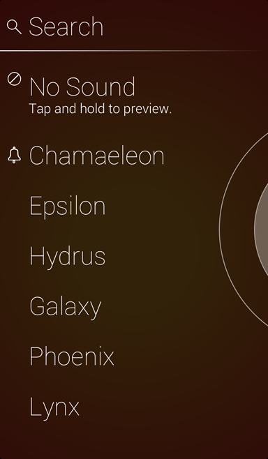

#Start

Start is a simple, gesture-driven alarm, timer and stopwatch. Create up to six faces with custom themes, actions, and sounds or music of your choice.

####Features

- Activate an alarm or timer by flicking up on the rings and watch Start countdown the time.
- Wake up to your music by locking your device while Start is open.
- Switch between Alarm and Timer mode by tapping the center of the rings.
- Swipe down for stopwatch mode.
- Pinch to delete an alarm.
- Easily add more time to an alarm by using Start's custom snooze duration
- Specify an action to launch an installed app of your choice
- Supported launch apps include Facebook, Fantastical, Instagram, Music, Pandora, Path, Reeder, Rdio, Safari, Sparrow, Spotify and Tweetbot.

Have another app you would like to have added to the list of actions? Email start@tackmobile.com.

