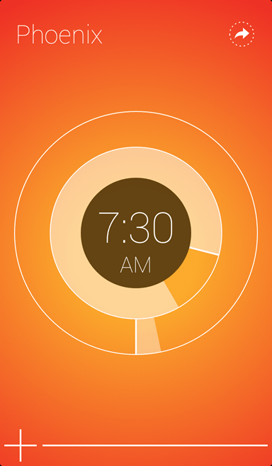

#Start 
Start is a simple, gesture-driven alarm, timer and stopwatch. Create up to six faces with custom themes and sound or music. Specify an action, which launches to installed apps like Facebook, Fantastical, Instagram, Music, Pandora, Path, Reeder, Rdio, Safari, Sparrow, Spotify and Tweetbot when an alarm or timer goes off. Easily add more time to an alarm by using Start’s custom snooze duration. 

* Activate an alarm or timer by flicking up on the rings and watch Start countdown the time.
* Wake up to your music by locking your device while Start is open.
* Switch between Alarm and Timer mode by tapping the center of the rings
* Swipe down for stopwatch mode.
* Pinch to delete an alarm.
* Have another app you would like to have added to the list of actions? Email start@tackmobile.com.

Please note after setting the time for each alarm, you must activate each desired alarm by flicking up.

